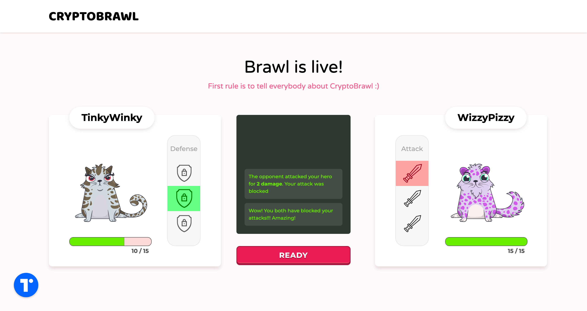
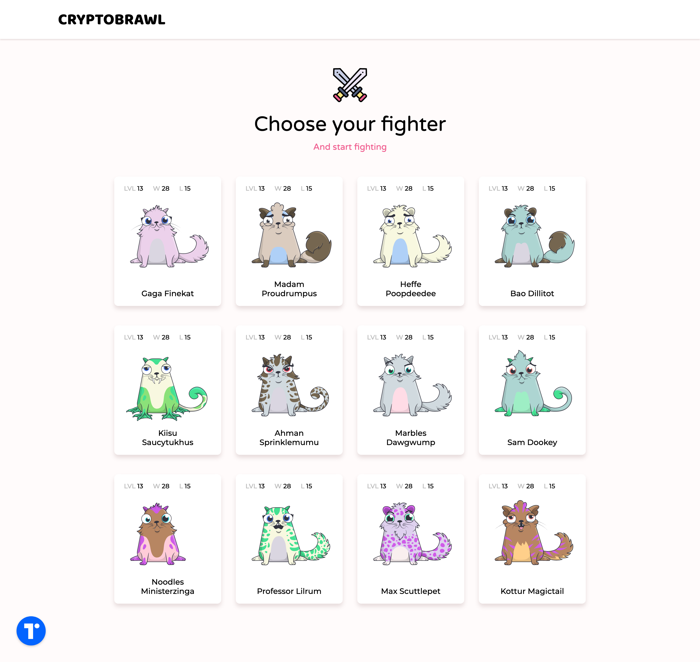
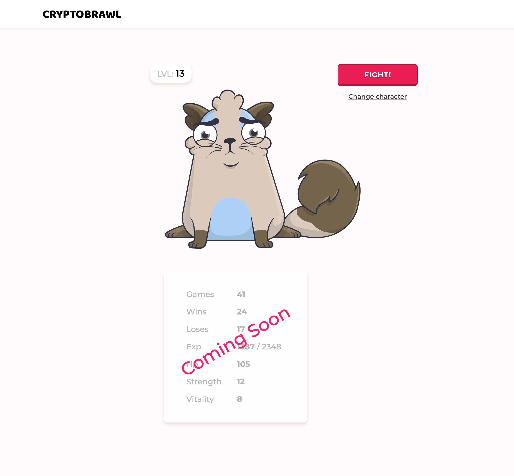
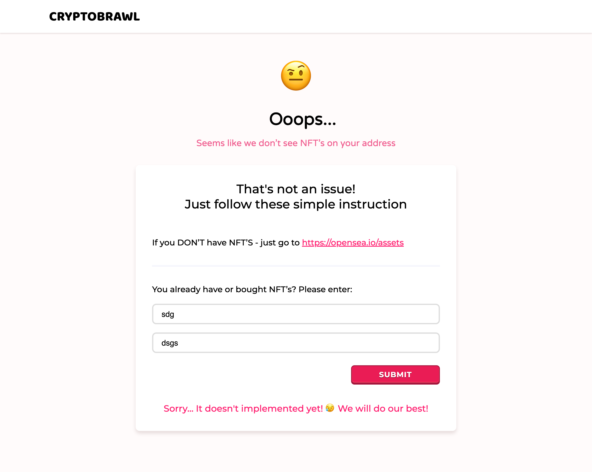

  

### CRYPTOBRAWL is Battleground for NFT's. It utilizes Ethereum blockchain as well as our own offchain solutions and provides best user experience accessing your NFT/ERC721 PvP Battle!

## Inspiration

The world of NFT's and ERC721 tokens is expanding on a daily basis. Why not give NFT owners the opportunity to fight among themselves using their tokens? CryptoBrawl is here to do that. We're striving to build an interoperable Battleground with advanced gaming mechanics

## What it does

In CRYPTOBRAWL user can quickly authenticate using MetaMask/Torus, then choose ERC721 token owned by his address for a battle and start fighting with a proper enemy using defense and attacks on a different parts of your ERC721 skin(legs, body, head). Winner receives skill points which he can spend on Health or Damage upgrades. It may lead to adding value to NFT, because it may become more powerful on a battleground 

## How we built it

At first, We had about 38 hours to build something great on ETHWaterloo 2019. That was our starting point.
We've decided to build NFT Battleground. Fun, UI/UX, Speed, Low cost and Desire to learn something new led us to defining our stack. 

We've developed CRYPTOBRAWL form scratch on ETHWaterloo 2019!

Our buidling was based on:
**SKALE as a platform for a battleground functioning**. We have used SKALE sidechain building abilities to create a smart contract and infrastructure inside the SKALE environment. Fights, Rounds, Win stat and all of that stuff is operating on SKALE
**Our own Offchain environment.** We've build offchain solution to enhance speed and effectiveness by reducing blockchain transaction numbers which leads to reducing of overall costs. Building offchain solution from scratch was quite challenging but we've done it!
**Ethereum mainnet in which all of that NFT is existing** No comments, thanks to Ethereum we have a dApps and all of that infrastructure we can work with
**Torus/MetaMask** as a convenient way to authenticate users and their addresses where NFT's are stored
Using all of that we've built cool UI/UX and game mechanics which we've deployed in test mode on [CRYPTOBRAWL](https://cryptobrawl.online)
**Smart-contracts on Solidity**. We've developed complex Battleground smart-contract from scratch.

## Challenges we ran into

Torus was quite challenging when connecting to SKALE. We've cooperated with their team and even found some bugs. Thanks to the Torus team, we've successfully integrated Torus and SKALE!
We've didn't find appropriate technologies for our Offchain idea. That's why we developed our own Offchain architecture. There was a huge amount of logics for validating Offchain transaction.
Challenging was testing Smart-Contract in SKALE network using Truffle.
Smart-contract for a Battleground was a complex thing as well as Fight searching mechanism.
Of course, challenging was develop all these things in 38 hours =)

## Accomplishments that we're proud of

We are really proud that we went through all of these challenges successfully and managed to develop cute UI/UX

## What we learned

We learned SKALE, Torus and did a lot of research in Offchain sphere. We also learned how to develop gaming interfaces and how to work better in terms of a tight deadlines and lack of sleep =)

## What's next for CRYPTOBRAWL
 
 
### Background

| Name | Role | Background | 
| ---- | ---- | ---------- |
| Ivanov Pavel | Front-end / solidity developer | Over 7 years of experience in Front-End Development, ex CoFounder of Leading Online journalism startup, 1-st place IcoLab Hackaton, 2-nd place LAToken hackaton, 3-rd place Blockchainhack 2017 |
| Golovanov Ivan | UI/UX / Analyst | Product Owner at Roobee; Hashlab co-founder; Former Nordea Markets investment analyst, Masters in International Finance|
| Kaizer Denis | Back-end / solidity developer | Head of R&D at Roobee; Hashlab co-founder; Awarded Overall Winner of ETHWaterloo 2017; Selected as the winner BlockchainHack Russia 2017 by Qtum; Dapp architect, Solidity expert; Author of scientific work "Decentralized Reputation Assessment System in Oracles Networks" |
| Putilov Dmitry | Full-stack developer | Team lead at Roobee; Over 16 years of experience in Full-stack Development |

### Screenshots

  

  

  

  

  

